# Beschreibung von Rückhaltesystemen

Ein Rückhaltesystem sorgt für ein sicheres Erlebnis auf der Attraktion. Einige Systeme werden miteinander auch gerne kombiniert.

Kannst Du fehlende Bescheibungen nachliefern? Dann melde Dich gerne unter [Kontakt](../contact/index.md) bei uns.

## Becken- Bauchbügel

!!! info ""
    Eine Auflagefläche, die mit gewissen Druck auf dem Bauch oder unterem Rücken, Deine Position festigt und während der Fahrt stabilisiert. Es kann pro Fahrgast ein eigener Bügel sein oder in manchen Attraktionen auch eine Stange in gesamter Breite der Sitzreihe. In neueren Attraktionen kommt dieser Bügel auch schon mal von oben.
    

    <figure markdown>
    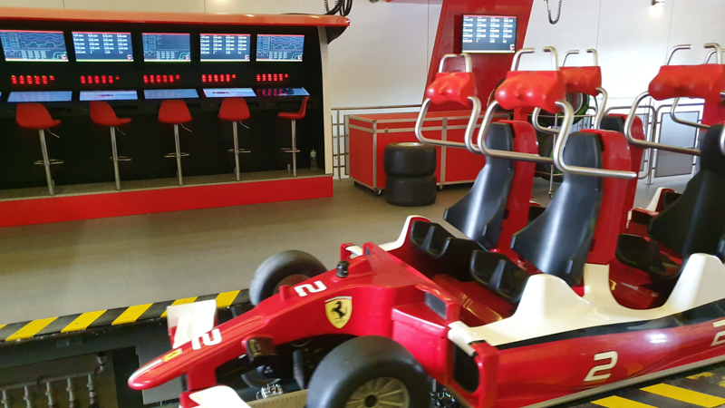
    <figcaption>Bauchbügel überkopf</figcaption>
    </figure>
    <figure markdown>
    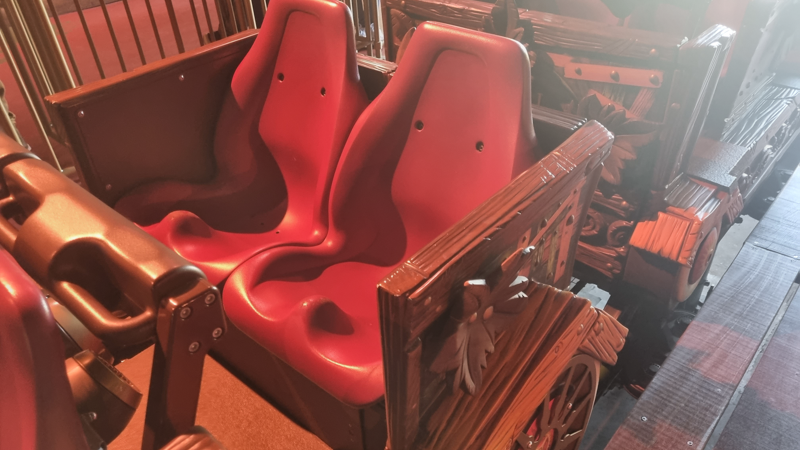
    <figcaption>Bauchbügel, einzeln frontal</figcaption>
    </figure>
    <figure markdown>
    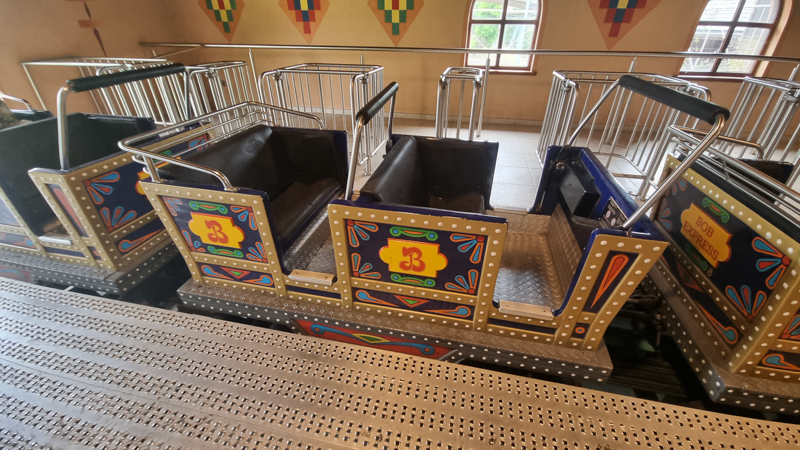
    <figcaption>Bauchbügel, reihe frontal</figcaption>
    </figure>
    <figure markdown>
    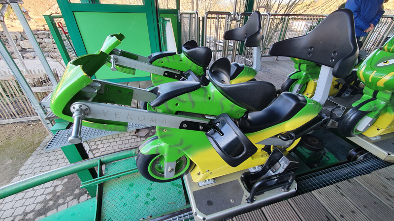
    <figcaption>Beckenbügel mit Oberschenkel</figcaption>
    </figure>
    

## Schulterbügel

!!! info ""
    Ein Bügelsystem das von oben auf Deine Schultern gesetzt wird. In der Regel wird der Kopf zwischen den Bügeln rechts und links eingeführt und der Vorbau auf dem Oberkörper gepresst. Oft wird dieser Bügel auch mit einem zusätzlichen Sicherheitsgurt von unten noch gesichert.
    

    <figure markdown>
    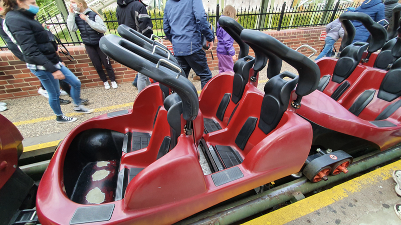
    <figcaption>Schulterbügel einfach</figcaption>
    </figure>
    <figure markdown>
    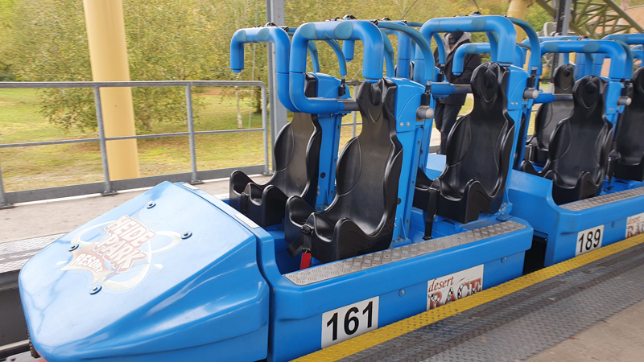
    <figcaption>Schulterbügel inkl. Bauchstabilisation</figcaption>
    </figure>
    <figure markdown>
    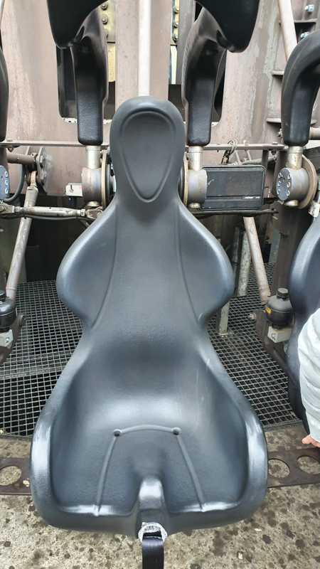
    <figcaption>Schulterbügel mit einfachem Gurt</figcaption>
    </figure>
    <figure markdown>
    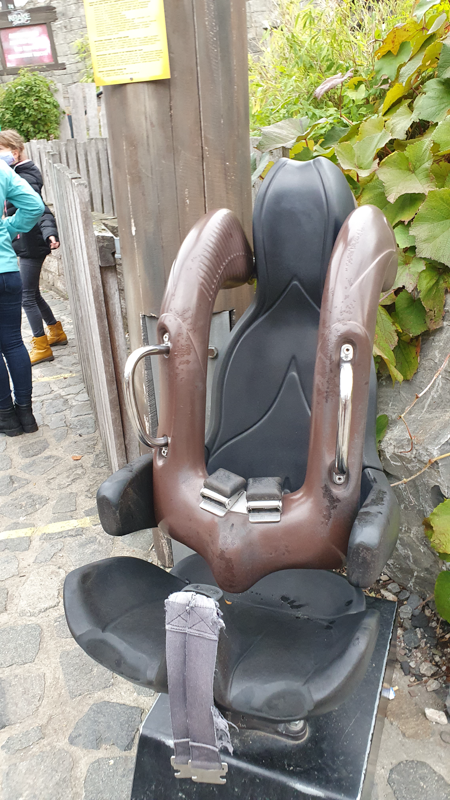
    <figcaption>Schulterbügel mit doppeltem Gurt</figcaption>
    </figure>
    

## Sicherheitsgurt

!!! info ""
    Ein einfacher Gurt, wie er im Kraftfahrzeug eingesetzt wird. Als Zwei- oder Dreipunkt-System oder durch eine Schlaufe im Einsatz.
    

    <figure markdown>
    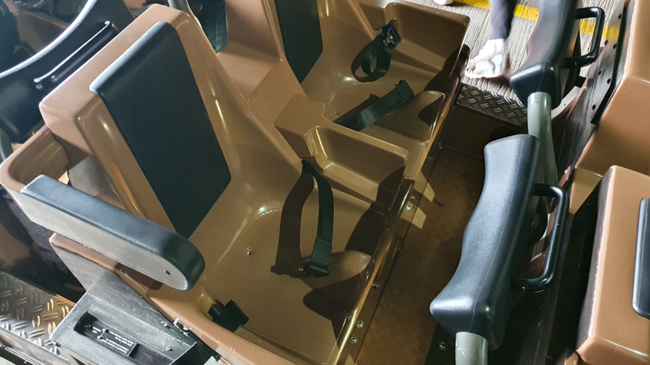
    <figcaption>Sicherungsgurt mit Bauchbügel, einzeln</figcaption>
    </figure>
    <figure markdown>
    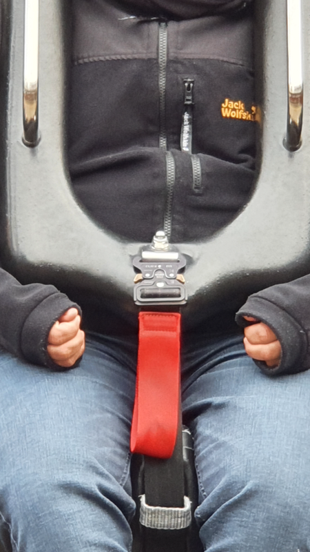{ width="200px"}
    <figcaption>Sicherungsgurt an Schulterbügel</figcaption>
    </figure>
    

## Westenbügel

!!! info ""
    Der Westenbügel ist dem Schulterbügel sehr ähnlich. Eingearbeitet ist eine Art Weste, die noch einen umfangreicheren aber besser verteilten Druck auf den Oberkörper ausübt.
    

    <figure markdown>
    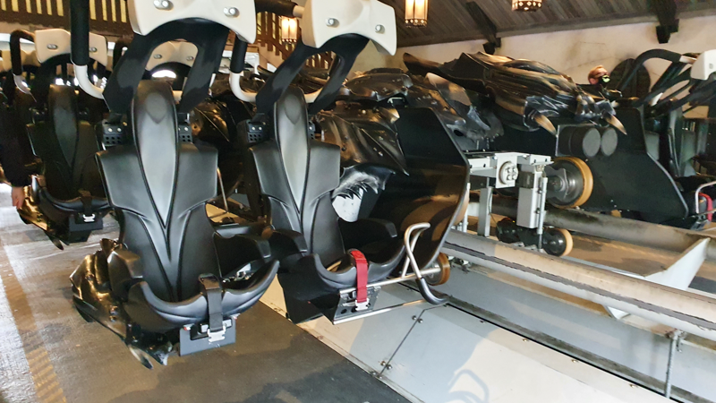
    <figcaption>Schulterbügel mit eingebauter Weste und Gurtsicherung</figcaption>
    </figure>
    

