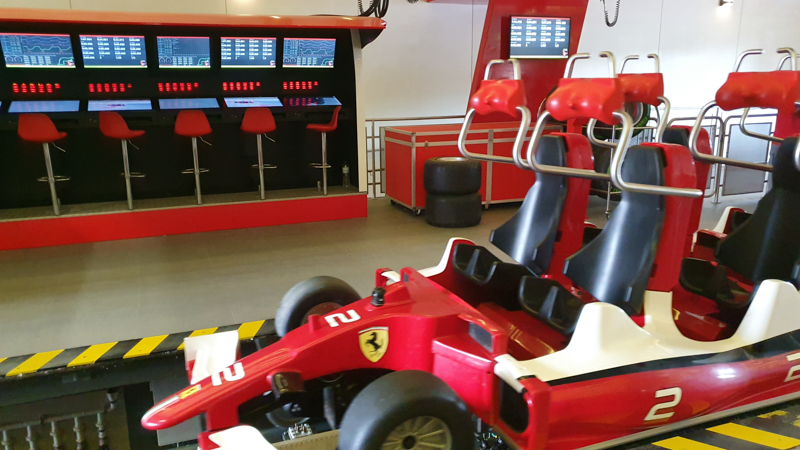
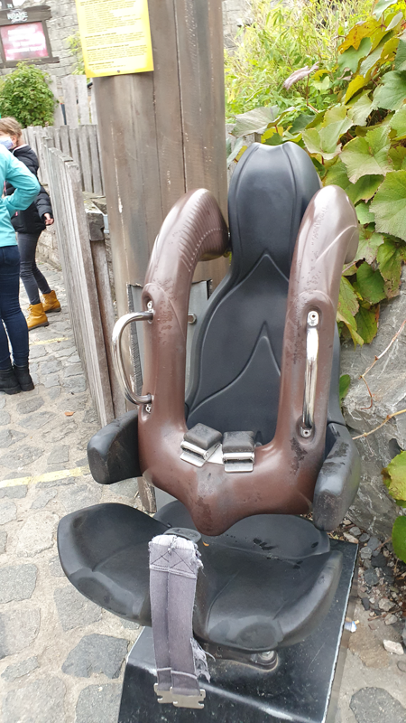
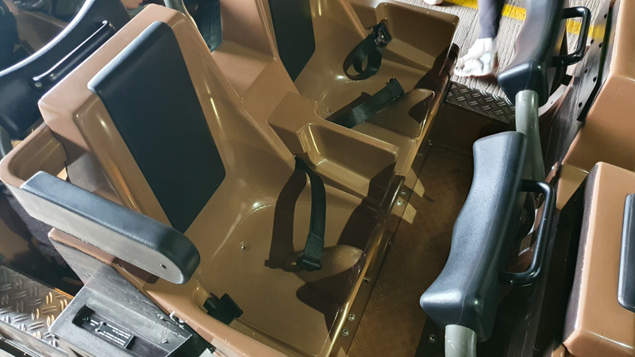
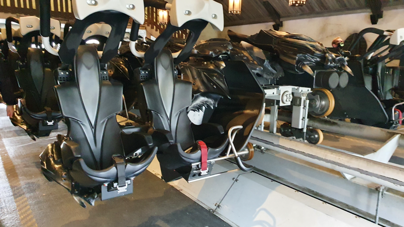

# Description of restraint systems

A restraint system ensures a safe experience on the attraction. Some systems are often combined with each other.
Can you provide missing descriptions? Then please contact us at [contact](../contact/index.md).

## Lap bar

!!! info ""
    A support surface that applies pressure to the abdomen or lower back to stabilise your position during the ride. It can be a separate bar for each passenger or, in some attractions, a bar across the entire width of the row of seats. In newer attractions, this bar also comes from above.
    

    <figure markdown>
    
    <figcaption>Lap bar above head</figcaption>
    </figure>
    <figure markdown>
    
    <figcaption>Lap bar, single frontal</figcaption>
    </figure>
    <figure markdown>
    
    <figcaption>Lap bar, row frontal</figcaption>
    </figure>
    <figure markdown>
    
    <figcaption>Lap bar upper leg</figcaption>
    </figure>
    

## Shoulder restraints

!!! info ""
    A stirrup system that is placed on your shoulders from above. As a rule, the head is inserted between the stirrups on the right and left and the stem is pressed onto the upper body. Often this bar is also secured with an additional safety belt from below.
    

    <figure markdown>
    
    <figcaption>Shoulder restraints single</figcaption>
    </figure>
    <figure markdown>
    
    <figcaption>Shoulder restraints incl. Lab stabiliszion</figcaption>
    </figure>
    <figure markdown>
    
    <figcaption>Shoulder restraints with a strap</figcaption>
    </figure>
    <figure markdown>
    
    <figcaption>Shoulder restraints with double strap</figcaption>
    </figure>
    

## Safety belt

!!! info ""
    A simple belt as used in the motor vehicle. As a two- or three-point system or through a loop in use.
    

    <figure markdown>
    
    <figcaption>Safety belt with lap bar, single</figcaption>
    </figure>
    <figure markdown>
    { width="200px"}
    <figcaption>Safety belt with shoulder restraints</figcaption>
    </figure>
    

## Waistcoat hanger

!!! info ""
    The waistcoat strap is very similar to the shoulder strap. A kind of waistcoat is incorporated, which exerts even more extensive but better distributed pressure on the upper body.
    

    <figure markdown>
    
    <figcaption>Shoulder restraint with built-in waistcoat and belt lock</figcaption>
    </figure>
    

