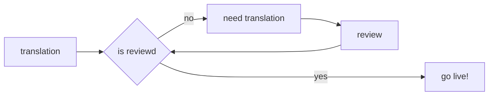
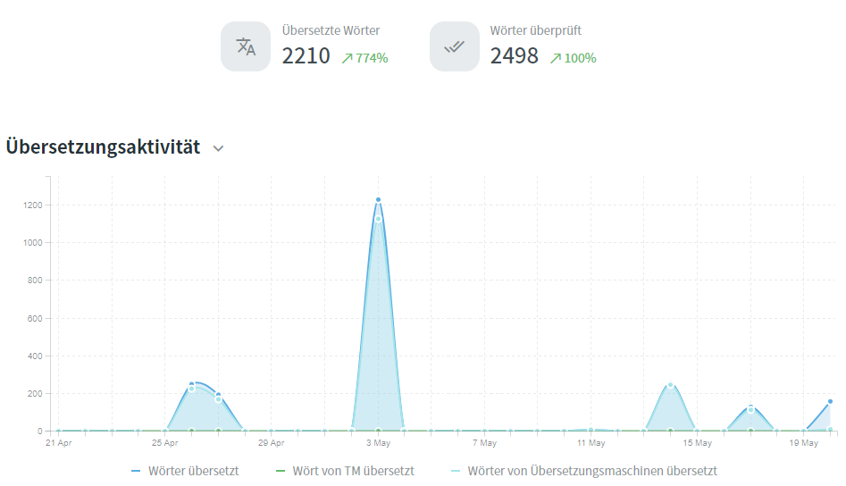

## Account erstellen

Nach der Installation unserer App, kannst Du einen Account erstellen. Der Account dient zum einloggen auf in der **App** und auch **Webseite**.

<figure markdown>
[Account erstellen: coaster.cloud](https://coaster.cloud/account/register){:target="_blank" .md-button }
</figure>

## Premium Funktionen

Als registrierter Nutzer können wir Dir nun folgende Funktoinen bereitstellen:

<figure markdown>

Screenshot App
</figure>

- :material-chart-bar-stacked: Eigene Statistiken

    ---
    Aus dem registieren der Parkbesuche und dort gefahrenen Attraktionen, bilden wir außergewöhnliche Statistiken.

- :fontawesome-brands-fort-awesome: Parkbesuche zählen

    ---
    Jeder Parkbesuch der aufgezeichnet wird, kann von Dir nachvollzogen und für die Statistik gezählt werden. Daraus ergibt sich eine schöne Statistik.

- :material-counter: Fahrten zählen

    ---
    Wir lieben Statistiken. Deswegen `counten` wir unsere Fahrten. Daraus ergeben sich dann verrückte Statistiken.

- :material-heart-plus: Favoriten festlegen

    ---
    Parks oder Attraktionen auf die Du viel Wert legst und gerne schneller erreichen möchtest.

- :material-image-plus: Foto Upload

    ---
    Lade Fotos von Objekten hoch (kein Familien-Album) und lasse die Fotos von anderen Nutzern :material-thumb-up-outline: bewerten. Die schönsten Fotos stehen übrigens oft als Titelbild zur Verfügung.

- :material-source-pull: Beitragen / Mitmachen

    ---
    Mit Deinem Profil kannst Du zu unserer `coaster.cloud` Datenbank Beiträge leisten. Wie das funktioniert, findest Du [hier](../contribute/).

- :fontawesome-solid-users: Gruppenfunktion [^1]

    ---
    Nutzer können mittels Code zu einer Gruppe zusammengefasst werden. Sie sehen nun die `Counts` der anderen. [BETA][^1]

## Multilingual

Unsere coaster.cloud App ist mehrsprachig verfügbar. Die Multilingualen Übersetzungen werden hierbei auch durch unsere Community beigetragen. Mit Hilfe von [crowdin.com](https://crowdin.com/project/coastercloud) können wir gemeinsam an einer Übersetzung arbeiten. Die größte Herausforderung dabei sind die speziellen Begriffe, die wir in dieser Branche nutzen. Auch Du kannst bei der Übersetzung helfen.

Als Übersetzer kannst Du die von Dir unterstützte Sprache bei [crowdin.com](https://crowdin.com/project/coastercloud) aktivieren. Die Basis der Sprache ist britisches englisch. In einer sehr einfachen "links / rechts" Tabelle und mit AI Unerstützung, kannst Du nun so viel Übersetzen wie Du gerade zeit hast.

Der Clou an [crowdin.com](https://crowdin.com/project/coastercloud) : Nach dem Übersetzen steht Deine Übersetzung in einem "Review Mode". Das bedeutet, dass die Übersetzung nicht sofort Live geschaltet wird, sondern von einer weiteren Person kontrolliert wird. Wenn Du eine Übersetzung von jemand anderen siehst und diese auch passend findest - mach doch einfach einen Haken dran. Daran merkt der Reviewer schneller, dass diese Übersetzung korrekt ist.

### Unterstützte Sprachen in der App

- :flag_gb: Englisch (source)
- :flag_de: Deutsch
- :flag_nl: Niederländisch
- :flag_fr: Französisch
- :flag_it: Italienisch
- :flag_es: Spanisch
- :flag_pt: Portugiesisch

<figure markdown>
  
  <figcaption>CrowdIn.com Aktivitäten</figcaption>
</figure>

[^1]: Das Gruppenfeature steht aktuell nur BETA Testern und ausgesuchten Partnern zur Verfügung
